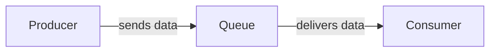

# 4장 분산 메시지 큐
## Tutorial

***메시지 큐를 사용할 때의 이점***

- 결합도 완화 : 작고 독립적인 블록/컴포넌트들 간의 강한 결합을 끊고, 독립적으로 운영 가능
- 규모 확장성 개선 : 트래픽 부하에 따라 producer, consumer 조절
- 가용성 개선 : 시스템의 특정 컴포넌트에 장애가 발생해도 다른 컴포넌트는 큐와 계속 상호작용을 이어갈 수 있음
- 성능 개선 : 비동기 통신 가능

***메시지 큐 VS 이벤트 스트리밍 플랫폼***

- 아파치 Kafka
- 아파치 Pulsar

---

- 아파치 RocketMQ
- 아파치 RabbitMQ
- 아파치 ActiveMQ
- ZeroMQ

→ 이 2개 간의 서로 지원하는 기능이 거의 유사해지며, 경계가 모호해지고 있음

e.g. 

**`MQ`**는 스트리밍 기능을 통해 메시지를 반복적으로 소비할 수 있는 동시에 데이터의 장기 보관도 가능하다. (이벤트 스트리밍 플랫폼과 유사)

**`이벤트 스트리밍`** 중 아파치 Pulsar는 분산 메시지 큐로 사용이 가능할 정도로 유연하고 성능이 좋다.

> 이벤트 스트리밍 플랫폼에서만 이용 가능한 **부가 기능을 갖춘 분산 메시지 큐**를 설계해보자!
> 

→ 부가 기능에는 데이터 장기 보관, 메시지 반복 소비 등이 있다

## 1단계 문제 이해 및 설계 범위 확정

- `메시지`
    - 포맷 : 텍스트 형태 지원 (멀티미디어 지원은 고려X)
    - 평균 크기 : 수 KB 수준
    - 전달 방식 : **at-least-once (필수)** / at-most-once / exactly once → 사용자가 설정 가능하도록 모두 지원하는 것이 이상적
- `부가 기능`
    - 반복적인 소비 지원 ⇒ 하나의 메시지를 여러 소비자가 수신하는 것이 가능해야 함
        - fyi. 전통적인 분산 메시지 큐 -  한 번 소비되면 큐에서 지워짐
    - 생산된 순서대로 소비
        - fyi. 전통적인 분산 메시지 큐 -  순서 보장 X
    - 데이터의 지속성 : 약 2주
- `지원 규모`
    - 생산자, 소비자 수 : 많을수록 좋음
    - 목표 대역폭(throughput) :높을수록 좋음 (로그 수집 등에 사용하기 위함)
    - end-to-end 지연시간 : 낮을수록 좋음

### 기능 요구사항 정리

1. 생산자는 메시지 큐에 메시지를 보낼 수 있어야 한다
2. 소비자는 메시지 큐를 통해 메시지를 수신할 수 있어야 한다
3. 메시지는 반복적으로 수신할 수도 있어야 하고, 단 한 번만 수신하도록 설정될 수도 있어야 한다
4. 오래된 이력 데이터는 삭제될 수 있다
5. 메시지 크기는 KB 수준이다
6. 메시지가 생산된 순서대로 소비자에게 전달될 수 있어야 한다
7. 메시지 전달 방식은 최소 한 번, 최대 한 번, 정확히 한 번 중에 설정할 수 있어야 한다

### 비기능 요구사항 정리

1. 높은 대역폭 vs 낮은 전송 지연 중 하나를 설정으로 선택 가능한 기능
2. 규모 확장성 : 분산 시스템인 만큼 메시지 양이 급증해도 처리 가능해야 함
3. 지속성 및 내구성 : 데이터가 디스크에 지속적으로 보관되어야 하며, 여러 노드에 복제되어야 함

## 2단계 개략적 설계안 제시 및 동의 구하기

메시지 큐의 핵심 컴포넌트 및 상호작용 흐름도

메시지 큐는 생산자와 소비자 사이의 결합을 느슨하게 하는 서비스로, 생산자와 소비자의 독립적인 운영 및 규모 확장을 가능하게 한다!

### 메시지 모델

`일대일 모델` (point-to-point)

- 큐에 전송된 메시지는 오직 한 소비자만 가져갈 수 있다
- 어떤 소비자가 메시지를 가져갔다는 사실을 큐에 알리면(ack), 해당 메시지는 큐에서 삭제된다

> **❗ 분산 메시지 큐 ❗ - 소비자 그룹을 통해 지원**
> 

`발행-구독 모델` (publish-subscribe) 

- topic : 메시지를 주제별로 정리 및 보관하는 데 사용되며, 메시지 큐 서비스 전반에 고유한 이름을 가짐
- topic에 전달된 메시지는 해당 topic을 구독하는 모든 소비자에 전달된다

> **❗ 분산 메시지 큐 ❗ - 토픽을 통해 구현**
> 

### 토픽, 파티션, 브로커

***한 토픽에 보관되는 데이터 양이 커져서 서버 한 대로 감당하기 힘들어진다면?***

→ 파티션, 즉 샤딩 기법을 활용하여 해결할 수 있다

1. 토픽을 여러 파티션으로 분할한 다음, 메시지를 모든 파티션에 균등하게 나누어 보낸다
    
    *파티션 = 토픽에 보낼 메시지의 작은 부분집합
    
2. 파티션은 메시지 큐 클러스터 내의 서버에 고르게 분산 배치한다
    
    *브로커 = 파티션을 유지하는 서버
    
3. 토픽의 용량을 늘리고 싶으면, 파티션 개수를 늘리면 된다
    
    *오프셋(offset) = 파티션 내에서의 메시지 위치
    
    - 각 토픽의 파티션은 FIFO 큐처럼 동작 ⇒ 같은 파티션 내에서 순서가 유지된다
    - 파티션은 가장 작은 저장 단위 ⇒ 미리 충분히 할당해두어야 동적으로 늘리는 일을 피할 수 있다
4. 처리 용량을 늘리고 싶으면, 소비자를 더 추가하면 된다

<aside>
🌟 파티션을 브로커에 분산하는 것이 높은 규모 확장성을 달성하는 비결이다

</aside>

Produce : 생산자가 보낸 메시지는 해당 토픽의 파티션 가운데 보내지게 되고, 메시지에 사용자 ID와 같이 키 값이 붙어 있으면 해당 키 값을 가진 모든 메시지가 같은 파티션으로 보내진다. (키가 없다면 무작위로 전송)

Consume : 토픽을 구독하는 소비자는 하나 이상의 파티션에서 데이터를 가져오게 되고, 각 구독자는 해당 토픽을 구성하는 파티션의 일부를 담당한다. ***= consumer group***

### 소비자 그룹

> 소비자 그룹 내 소비자는 토픽에서 메시지를 소비하기 위해 서로 협력한다
> 
- 하나의 소비자는 여러 토픽을 구독할 수 있고, 오프셋을 별도로 관리한다 → ex. 과금용 그룹, 회계용 그룹 등
- 같은 그룹 내 소비자는 메시지를 병렬로 소비할 수 있다 (그룹1 → 토픽A, 그룹2 → 토픽A,B) by pub-sub

<aside>
🚨 데이터를 병렬로 읽게 될 때의 문제점

**대역폭 측면에서는 좋지만, 같은 파티션 내의 메시지를 순서대로 소비할 수는 없다**

→ 1가지 제약사항을 추가하면 해결됨

> *어떤 파티션의 메시지는 한 그룹 안에서는 오직 한 소비자만 읽을 수 있도록 한다 (그룹 내 소비자 수 ≤ 토픽의 파티션 수일 때만 모든 소비자에게 도달 가능)*
> 

위 제약사항을 도입하면, 모든 소비자를 같은 소비자 그룹에 두었을 때 같은 파티션의 메시지가 오직 한 소비자에 의해서만 가져갈 수 있게 되므로 결국 **`일대일 모델`**에 수렴하게 된다

</aside>

### 개략적 설계안

**클라이언트**

- `생산자` : 메시지를 특정 토픽으로 보낸다
- `소비자 그룹` : 토픽을 구독하고 메시지를 소비한다

**핵심 서비스 및 저장소**

- `브로커` : 파티션들을 유지한다 → 하나의 파티션은 특정 토픽에 대한 메시지의 부분 집합을 유지한다
- `저장소`
    - 데이터 저장소 : 메시지는 파티션 내 데이터 저장소에 보관
    - 상태 저장소 :  소비자 상태 보관
    - 메타데이터 저장소 :  토픽 설정, 토픽 속성 등 보관
- `조정 서비스` (coordination service)
    - 서비스 탐색 : 어떤 브로커가 살아있는가
    - 리더 선출 : 브로커 중 하나는 컨트롤러 역할을 담당, 한 클러스터에 반드시 활성 상태인 컨트롤러가 하나 있어야 함 → 이는 파티션 배치를 책임지게 됨
    - 아파치 주키퍼나 etcd는 보통 컨트롤러 선출을 담당하는 컴포넌트로 널리 이용됨

## 3단계 상세 설계

<aside>
💡 **주요 내용**

- 회전 디스크(rotational disk)의 높은 순차 탐색 성능과 현대적 운영체제가 제공하는 적극적 디스크 캐시 전략(aggresive disk caching strategy)을 잘 이용하는 디스크 기반 자 구조(on-disk data structure) 활용
- 메시지가 생상자로부터 소비자에게 전달되는 순간까지 아무 수정 없이도 전송이 가능하도록 하는 메시지 자료 구조 설계 및 활용
    - 전송 데이터 양이 막대한 경우, 메시지 복사에 드는 비용을 최소화 하기 위함
- 일괄 처리(batching)를 우선하는 시스템 설계
    - 생산자 - 메시지 일괄 전송
    - 소비자 - 메시지 일괄 수신
</aside>

### 데이터 저장소

<aside>
👀 메시지 큐의 트래픽 패턴

- 읽기와 쓰기가 빈번하게 발생
- 갱신/삭제 연산은 발생하지 X
    
    fyi. 전통적인 메시지 큐 - 메시지가 신속하게 전달되지 못해 큐가 제때 비워지지 않는 경우를 제외하면 메시지를 지속적으로 보관하지 않음 (제때 소비되면 삭제 연산이 발생하기는 함)
    
- 대부분 순차적인 읽기/쓰기
</aside>

**Option 1. 데이터베이스**

- 관계형 DB - 토픽별로 테이블 생성, 토픽에 보내는 메시지는 해당 테이블에 새로운 레코드로 추가
- NoSQL DB - 토픽별로 컬렉션 생성, 토픽에 보내는 메시지는 하나의 문서가 됨

→ 데이터 저장 요구사항을 맞출 수는 있겠으나, 읽기와 쓰기가 동시 다발적으로 빈번하게 발생하는 경우이기에 DB를 설계하는 방안은 부적합하다 (오히려 시스템의 병목이 될 수 있음)

**Option 2. 쓰기 우선 로그(Write-Ahead Log, WAL)**

> WAL이란? 새로운 항목이 추가되기만 하는(*append-only*) 일반 파일
> 
> 
> 
> 
- 다양한 시스템에서 사용되는 기술
    - MySQL의 복구 로그(redo log) 구현
    - 아파치 주키퍼에서도 활용됨
- **⭐ 지속성을 보장해야 하는 메시지는 디스크에 WAL로 보관할 것을 추천한다**
- WAL에 대한 접근 패턴 : 읽기/쓰기 모두 순차적, 회전식 디스크 기반 저장장치 이용
    
    → 디스크가 아주 좋은 성능을 보임 + 큰 용량 대비 저렴한 가격
    

`PUT` : 파티션의 꼬리 부분에 추가

- 오프셋은 점진적으로 증가하게 됨

→ 로그 파일 줄 번호를 오프셋으로 사용하면?

파일의 크기가 무한정 커질 수 없어 세그먼트 단위로 나누어야 함

→ 세그먼트를 사용하면?

활성 상태의 파일에만 추가되므로, 세그먼트 크기가 한계에 도달하면 새로운 파일을 생성하는 로직

### 디스크 성능 관련 유의사항

- 디스크 드라이브(회전식 디스크) - random 패턴이 아닌, **순차적 데이터 접근 패턴**을 활용하는 디스크 기반 자료구조를 사용함으로써 수백 MB/sec 수준의 읽기/쓰기 성능을 쉽게 달성할 수 있음
    
    e.g. RAID로 구성된 현대적 디스크 드라이브
    
- 디스크 데이터를 메모리에 적극적으로 캐시 (필요에 따라 가용한 메모리 전부를 디스크 데이터 캐시에 활용하기도 함)
    
    e.g. WAL - OS가 제공하는 디스크 캐시 기능 적극 활용
    

### 메시지 자료 구조

<aside>
🔑 메시지 구조

> 높은 대역폭 달성의 열쇠, 생산자-메시지 큐-소비자 사이의 계약(contract)
> 

***→ 메시지가 큐를 거쳐 소비자에게 전달되는 과정에서 불필요한 복사가 일어나지 않도록 하자!***

*메시지가 중간에 변경된다면, 값비싼 copy 연산이 필요하고, 이는 시스템 전반의 성능에 치명적인 영향을 미칠 수 있다

</aside>

**`메시지 키`**

- 파티션을 정할 때 사용 (by hash(key) % numPartitions 공식)
- 키가 주어지지 않은 메시지의 파티션은 무작위로 결정됨

**`메시지 값`**

- 메시지의 내용(payload)
- Type - 일반 text, 압축된 이진 block

**[메시지 기타 필드]**

`토픽` : 메시지가 속한 토픽의 이름

`파티션` : 메시지가 속한 파티션의 ID

`오프셋` : 파티션 내 메시지의 위치 

**→ 메시지는 위 3가지 정보를 알면 찾을 수 있다!**

`타임스탬프` : 메시지가 저장된 시각

`크기` : 메시지의 크기

`CRC` : 순환 중복 검사(Cyclic Redundancy Check)   *주어진 데이터의 무결성을 보장하는 데 이용

### 일괄 처리(batching)

<aside>
💡 일괄 처리가 **성능 개선**에 중요한 이유

- OS가 여러 메시지를 한 번의 네트워크 요청으로 전송할 수 있도록 함 → 값비싼 네트워크 왕복 비용 제거
- 브로커가 여러 메시지를 한 번에 로그에 기록하면 더 큰 규모의 순차 쓰기 연산이 발생하고, OS가 관리하는 디스크 캐시에서 더 큰 규모의 연속된 공간을 점유하게 됨 → 더 높은 디스크 접근 대역폭에 달성
</aside>

높은 대역폭 <> 낮은 응답 지연

- 낮은 응답 지연 - (in 전통적 메시지 큐) 일괄 처리 메시지 양 DOWN
- 처리량 UP - 토픽당 파티션 수 UP (낮아진 순차 쓰기 연산 대역폭을 벌충하기 위함

### 생산자 측 작업 흐름

> 라우팅 계층을 도입하여 ‘적절한’ 브로커에 메시지를 보내도록 하자!
> 

라우팅 계층

*무엇이 ‘적절한’ 브로커일까?*

- 브로커를 여러 개로 복제하여 운용하는 경우 - 리더 브로커

[Flow]

1. 생산자는 우선 메시지를 라우팅 계층으로 보낸다
2. 라우팅 계층은 메타데이터 저장소에서 사본 분산 계획을 읽어 자기 캐시에 보관한다
    - 메시지가 도착하면? 라우팅 계층에서 파티션-1의 리더 사본으로 보낸다
3. 리더 사본이 메시지를 받고 해당 리더를 따르는 다른 사본은 해당 리더로부터 데이터를 받는다
4. **충분한** 수의 사본이 동기화되면 리더는 데이터를 디스크에 기록(commit)한다
    
    → 데이터가 소비 가능 상태가 되는 시점
    
    - 기록이 끝나면 생산자에게 회신을 보낸다

<aside>
💡 **사본 동기화**

> **장애 감내가 가능한 시스템**을 만들기 위해, `리더`와 `사본`을 활용하자
> 
</aside>

[위 Flow의 단점]

1. 라우팅 계층을 도입함으로써 네트워크 노드가 하나 더 늘어나게 되므로 오버헤드가 발생 → **네트워크 전송 지연이 늘어난다**
2. 일괄 처리가 가능하면 효율을 많이 높일 수 있는데, 이는 고려하지 않은 설계

생산자 측 버퍼 및 라우팅 (단점 보완)

- 라우팅 계층을 생산자 내부로 편입
- 버퍼 도입
- 생산자 클라이언트 라이브러리의 일부로 생산자에 설치

[수정 이후의 장점]

1. 네트워크를 거치지 X → **전송 지연이 줄어든다**
2. 생산자는 메시지를 어느 파티션에 보낼지 결정하는 자신만의 로직을 가질 수 있음
3. 전송할 메시지를 버퍼 메모리에 보관했다가 목적지로 일괄 전송 가능 → **대역폭이 높아진다 (but, 그만큼 기다려야 하므로 응답 속도는 느려짐)**

*지연과 대역폭은 비례하므로, 생산자는 메시지 큐의 용도를 감안하여 일괄 처리 메시지 양을 조정해야 한다

### 소비자 측 작업 흐름

> 소비자는 특정 파티션의 오프셋을 주고 해당 위치에서부터 이벤트를 묶어 가져온다
> 

- Consumer A는 0~9까지
- Consumer B는 0~11까지

- 푸시 VS 풀
    
    `푸시 모델` : 브로커 → 소비자에게 데이터를 보내는 것
    
    👍🏻 
    
    - 낮은 지연 : 브로커는 메시지를 받는 즉시 소비자에게 보낼 수 있음
    
    👎🏻
    
    - **메시지를 소비하는 속도**가 **메시지를 생산하는 속도**보다 느릴 경우, 소비자에게 큰 부하가 걸릴 가능성이 있음
    - 생산자가 데이터 전송 속도를 좌우하므로, 소비자는 항상 그에 맞는 컴퓨팅 자원을 준비해 두어야 함
        - but, 소비자가 제때 처리하지 못하면 메시지가 버퍼에 쌓이며 wait 상태로 됨
    
    `풀 모델` : 소비자 → 브로커에서 데이터를 가져오는 것
    
    👍🏻 
    
    - 메시지 소비 속도는 소비자가 결정 (실시간 or 일괄)
    - 소비 속도가 느려지더라도, 소비자가 이를 늘리거나 생산 속도를 따라 잡을 때까지 기다리는 방식으로 해결 가능
    - 일괄 처리에 적합 - 소비자가 마지막으로 가져간 로그 위치 다음의 (모든 or 정해진 개수 만큼) 모든 메시지를 한번에 가져갈 수 있음
    
    👎🏻
    
    - 브로커에 메시지가 없어도 소비자가 계속 데이터를 끌어가려 시도할 것 ⇒ 컴퓨팅 자원의 낭비
        - 이는 롱 폴링 지원을 통해 일정 시간 기다리도록 함으로써 조금은 극복할 수 있다.
    

풀 모델의 동작 흐름도

1. 그룹-1에 합류하고 토픽-A를 구독하길 원하는 소비자가 해당 그룹 이름을 해싱하여 접속할 브로커 노드를 찾는다 
    
    *브로커 = 소비자 그룹의 코디네이터 (소비자 재조정을 위해 소비자들과 통신하는 브로커 → 그룹의 조정 작업**만** 담당)
    
2. 코디네이터는 해당 소비자를 그룹에 참여시키고 파티션-2를 해당 소비자에 할당한다
    - 파티션 배치 정책 : 라운드-로빈, 범위 기반 정책 등
3. 소비자는 마지막으로 소비한 오프셋 이후 메시지를 가져온다
4. 소비자는 메시지를 처리하고 새로운 오프셋을 브로커에 보낸다

*데이터 처리와 오프셋 갱신 순서는 **`메시지 전송 시멘틱`**에 영향을 미침

### 소비자 재조정

> 아래와 같이 **소비자 변경이 발생**하는 케이스에 대해, 어떤 소비자가 어떤 파티션을 책임지는지 다시 정하는 프로세스
> 
1. 새로운 소비자 합류
2. 기존 소비자가 그룹 탈퇴
3. 어떤 소비자에 장애 발생
4. 파티션 조정

→ 코디네이터가 매우 중요한 역할을 하며, 소비자에게 발생한 장애를 박동 신호가 사라지는 현상을 통해 감지한다. 또한, 장애를 감지하면 재조정 프로세스를 시작하여 파티션을 재배치한다 

### 상태 저장소

> ***메시지 큐 브로커의 상태 저장소에는 무엇이 저장될까?***
> 
> - 소비자에 대한 파티션의 배치 관계
> - 각 소비자 그룹이 각 파티션에서 마지막으로 가져간 메시지의 오프셋
>     
>     소비자는 오프셋으로 설정된 그 다음 위치부터 가져가므로, 앞의 메시지는 이미 읽어갔음을 의미한다
>     

[소비자 상태 정보 데이터가 이용되는 패턴]

- 읽기와 쓰기가 빈번하게 발생하지만 양은 많지 않다
- 데이터 갱신은 빈번하게 일어나지만 삭제되는 일은 거의 없다
- 읽기와 쓰기 연산이 무작위 패턴을 보인다
- 데이터의 일관성이 중요하다

### 메타데이터 저장소

> 토픽 설정, 속성 정보를 보관하는 곳
> 
> - 파티션 수, 메시지 보관 기관, 사본 배치 정보

특징 - 자주 변경되지 않으며, 양이 적다 + **높은 일관성을 요구**

→ 주키퍼가 적합!

<aside>
💡 주키퍼(ZooKeeper)

> 계층적 키-값 저장소 기능을 제공하는, 분산 시스템에 필수적인 서비스
> 
- 분산 메시지 큐를 설계하는 데 아주 유용
- 분산 설정 서비스, 동기화 서비스, 이름 registry 등으로 이용됨

*주키퍼가 도입 이후 달라진 점?*

1. 메타데이터와 상태 저장소는 주키퍼를 이용해 구현한다
2. 브로커는 이제 메시지 데이터 저장소만 유지하면 된다
3. 주키퍼가 브로커 클러스터의 리더 선출 과정을 돕는다
</aside>

### 복제

분산 시스템에서 하드웨어 장애는 흔한 일이므로, 데이터의 영구적 보관과 높은 가용성을 보장하기 위해 복제(replication)를 활용할 수 있다.

→ 생산자는 파티션에 메시지를 보낼 때 리더에게만 보내며, 다른 사본은 리더에서 새 메시지를 지속적으로 가져와 동기화한다

<aside>
💡 사본 분산 계획(replica distribution plan)

> 사본을 파티션에 어떻게 분산할지 기술하는 것
> 

→ 리더 브로커 노드가 생성하고, 메타데이터 저장소에 보관됨

</aside>

*[데이터 중심 애플리케이션 설계](https://dataintensive.net/) 5장과 연관

### 사본 동기화

***복제한 사본들 모두를 어떻게 동기화할까?***

- 동기화된 사본(In-Sync Replicas, ISR) : 리더와 동기화된 사본을 일컫는 용어

- 리더는 항상 ISR 상태다
- 리더 상태를 충분히 따라잡으면 ISR이 될 수 있다
    - replica.lag.max.messages ≥ (단순 사본에 보관된 메시지 개수 - 리더) : ISR
    - 각 파티션 담당 리더는 자기 사본들이 어느 메시지까지 가져갔는지 추적하여 ISR 목록을 관리한다
- 합의 오프셋 : 해당 오프셋 이전에 기록된 모든 메시지가 이미 ISR 집합 내 모든 사본에 동기화가 끝났음을 의미

> → ISR이 되면 새로운 메시지를 가져올 수 있다.
> 
> 
> → ISR 요건을 만족하는 사본에서는 메시지를 가져가지 않는다.
> 

`ACK=all`

생산자는 모든 ISR이 메시지를 수신한 뒤에 ACK 응답을 받는다

→ 메시지를 보내기 위한 시간이 길어지지만, 매시지의 영속성 측면에서는 best

`ACK=1`

생산자는 리더가 메시지를 저장하고 나면 바로 ACK 응답을 받는다

→ 응답 지연이 개선되지만, ACK를 보낸 직후 리더에 장애가 생기면 해당 메시지는 사본에 반영되지 못하므로 소실됨

`ACK=0`

생산자는 보낸 메시지에 대한 수신 확인 메시지를 기다리지 않고 계속 메시지를 전송하며 어떤 재시도도 하지 않는다

→ 낮은 응답 지연을 달성하기 위해 메시지 손실을 감수. 

→ 지표 수집, 데이터 로깅 등 처리해야 하는 메시지 양이 많고 데이터 손실에 상관 없는 경우에 적합

### 규모 확장성

- 생산자
    - 그룹 단위의 조정에 가담할 필요가 없음
    - 새로운 생산자를 추가/삭제함으로써 규모 확장성 달성
- 소비자
    - 새 소비자 그룹의 추가/삭제는 쉬움
    - 같은 소비자 그룹 내의 소비자 추가/삭제, 장애로 제거되어야 한다면 `재조정 메커니즘`이 처리
    
    → `소비자 그룹`, `재조정 메커니즘`의 소비자 측의 규모 확장성과 결함 내성을 보장
    
- 브로커
    - 브로커 노드가 추가/삭제될 때 사본을 재배치
    - 브로커 컨트롤러가 한시적으로 시스템에 설정된 사본 수보다 많은 사본을 허용하도록 하는 것
- 파티션
    - 파티션 수의 조정이 생산자, 소비자의 안정성에는 영향 X
    - 파티션 추가 : 지속적으로 보관된 메시지는 새로운 파티션으로 이동하지 않지만, 그 이후 오는 메시지는 모든 파티션에서 보관되어야 함
    - 파티션 삭제 : 퇴역시킨다는 결정이 난 파티션 외의 파티션으로 새로운 메시지를 보관하도록 하고, 해당 파티션을 아직 사용중인 소비자가 있을 수 있기 떄문에 바로 제거하지 않고 일정 시간 유지함
        - 실제로 제거되는 시점에는 생산자 그룹에서 재조정 작업 필요

### 메시지 전달 방식

- 최대 한 번(at-most once)
    
    > 메시지가 전달 과정에서 소실되더라도 다시 전달되는 일은 없다
    > 
    - 생산자 : `ACK=0`
    - 소비자 : 메시지를 읽고 처리하기 전에 오프셋부터 갱신
- 최소 한 번(at-least once)
    
    > 같은 메시지가 한 번 이상 전달될 수는 있으나 메시지 소실은 발생하지 않는다
    > 
    - 생산자 : 메시지를 동기/비동기적으로 보낼 수 있음. `ACK=1`, `ACK=all`
    - 소비자 : 데이터를 성공적으로 처리한 뒤에만 오프셋 갱신 (미처 오프셋을 갱신하지 못하고 죽었다가 다시 시작하면 중복 처리될 여지가 있음)
    
    → 메시지는 브로커나 소비자에 한 번 이상 전달될 수 있다
    
- 정확히 한 번(exactly once)
    
    > 중복을 허용하지 않으며, 구현에 이용할 서비스나 제3자 제품이 같은 INPUT에 대해 항상 같은 OUTPUT을 내도록 구현되어 있지 않은 애플리케이션에 특히 중요하다
    > 
    
    *가장 구현이 까다로움
    
    → 지불, 매매, 회계 등 금융 관련 응용에 적합
    

### 고급 기능

**메시지 필터링**

1. 토픽 자체를 분리하는 방식 - 같은 메시지가 여러 토픽에 중복되어 저장될 가능성 높음 ⇒ 비효율적
2. 소비자가 일단 모든 메시지를 받은 다음, 필요 없는 메시지는 버리는 방식 - 불필요한 트래픽에 의해 시스템 성능 저하가 우려됨
3. 브로커에 구현할 필터링 로직을 메시지의 payload가 아닌, metadata 영역에 두어 브로커가 효율적으로 읽어갈 수 있도록 하는 방식 
    
    e.g. 메시지마다 tags를 두고 이를 통해 메시지 필터링 - 소비자가 어떤 태그를 가진 메시지를 구독할지 지정할 수 있게 됨
    

**메시지 지연 전송 및 예약 전송** 

- 소비자에게 보낼 메시지를 일정 시간 지연시켜야 하는 경우
    
    [예시]
    
    - 주문 결제 시스템 - 30분 내로 결제가 이루어지지 않으면 주문 취소 처, 이루어지면 메시지로 주문 완료 전송
- 임시 저장소 및 타이밍 기능
    - 토픽에 바로 저장하지 않고 **`브로커 내부의 임시 저장소`**에 넣어 두었다가 시간이 되면 토픽으로 옮기는 방식
    1. 하나 이상의 특별 메시지 토픽을 임시 저장소로 활용할 수 있음
    2. 메시지 지연 전송 전용 메시지 큐를 사용하는 방안
    3. 계층적 타이밍 휠을 사용하는 방안

## 4단계 마무리

### 기타 고려사항

- 프로토콜 in 분산 메시지 큐
    - 메시지 생산, 소비, 박동 메시지 교환 등의 모든 활동을 설명
    - 대용량 데이터를 효과적으로 전송할 방법 설명
    - 데이터의 무결성을 검증할 방법 기술
    
    e.g. AMQP, Kafka Protocol
    

- 메시지 소비 재시도 : 제대로 받아 처리하지 못한 메시지는 일정 시간 뒤에 다시 처리를 시도해야 함
    - 실패한 메시지를 **`재시도 전용 토픽`**에 보낸 후, 나중에 다시 소비하는 방식 등

- 이력 데이터 아카이브 : 시간 기반 or 용량 기반 로그 보관 메커니즘이 있을 때, 이미 삭제된 메시지를 다시 처리하길 원하는 소비자가 존재하는 경우에 요구되는 기능
    - 오래된 데이터는 HDFS 같은 대용량 저장소 시스템이나 객체 저장소에 보관해두는 것

### 요약

