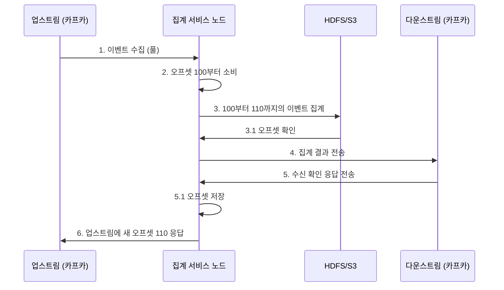

# 6장. 광고 클릭 이벤트 설계

디지털 광고가 전체 광고 매출에서 차지하는 비중은 점점 커지고 있다. 따라서 광고 클릭 이벤트를 추적하는 작업의 중요도도 높아지고 있는 실정이다. 

→ 페이스북이나 구글 규모의 ***광고 클릭 이벤트 집계 시스템(ad click event aggregation system)***을 설계해보자!

> 디지털 광고의 핵심 프로세스 : RTB(Real-Time Bidding, 실시간 경매)
> 


RTB 동작 절차

- 경매 절차를 통해 광고가 나갈 지면(inventory)을 거래한다
- 보통 1초 내에 모든 프로세스가 마무리 되어야 하므로, **속도가 매우 중요하다**
- 온라인 광고가 얼마나 효율적이었는지 측정하는 데 결정적인 역할을 하며, 결과적으로 광고주가 얼마나 많은 돈을 지불할지에 영향을 끼친다 ⇒ **데이터의 정확성도 중요하다**
    - 클릭 집계 결과에 따라 광고 캠페인 관리자는 광고 예산을 조정하기도 하고, 타깃 그룹/키워드를 변경하는 등 광고 전략을 수정하기도 한다
- 핵심 지표 - CTR(Click-Through Rate, 클릭률), CVR(Conversion Rate, 전환률)
    - 집계된 광고 클릭 데이터에 기반하여 계산한다

## 1단계 문제 이해 및 설계 범위 확정

- `입력 데이터 형태`
    - **여러 서버에 분산된 로그 파일**
    - 클릭 이벤트는 수집될 때마다 로그 파일의 끝에 추가된다
        - ad_id, click_timestamp, user-id, ip, country
- `데이터 양`
    - 매일 10억 개의 광고 클릭 발생
    - 광고는 2백만 회 게재
    - 광고 클릭 이벤트의 수는 매년 30%씩 증가
- `가장 중요하게 지원해야 할 질의`
    1. 특정 광고에 대한 지난 M분간의 클릭 이벤트 수
    2. 지난 1분간 가장 많이 클릭된 광고 100개 → 질의 기간, 광고 수는 변경 가능해야 하며 집계는 매분 이루어진다
    3. ip, user_id, country 등의 속성을 기준으로 상기 2개의 질의 결과를 필터링하는 것
- `고려해야 할 엣지 케이스`
    - 예상보다 늦게 도착하는 이벤트가 있을 수 있다
    - 중복된 이벤트가 있을 수 있다
    - **시스템 일부가 언제든지 다운될 수 있으므로 시스템 복구를 고려해야 한다**
- `지연 시간 요건`
    - 모든 처리는 수 분 내에 이루어져야 한다
        
        *RTB ≠ 광고 클릭 집계의 지연 시간 요건
        
        - **RTB 지연 시간**은 일반적으로 **1초 미만** (응답성 요구사항 존재)
        - **광고 클릭 이벤트 집계**는 **몇 분 정도의 지연** 허용 (주로 광고 과금 및 보고에 사용되므로)
        

### 기능 요구사항 정리

- 지난 M분 동안의 ad_id 클릭 수 집계
- 매분 가장 많이 클릭된 상위 100개 광고 아이디를 반환 (⇒ 지난 M분 동안 가장 많은 클릭이 발생한 상위 N개 ad_id 목록 반환)
- 다양한 속성에 따른 집계 필터링을 지원
- 데이터의 양은 페이스북, 구글 규모

### 비기능 요구사항 정리

- 집계 결과 정확성은 데이터가 RTB 및 광고 과금에 사용되므로 중요
- 지연되거나 중복된 이벤트를 적절히 처리할 수 있어야 함
- 견고성(reliability) :  부분적인 장애는 감내 가능
- 지연 시간 요구사항 :  전체 처리 시간은 최대 수 분을 넘지 않아야 함

### 개략적 추정

- DAU : 10억 명
- 각 사용자는 하루에 평균 1개의 광고를 클릭한다고 가정 → 하루 광고 클릭 이벤트 발생 수 : 10억 건
- 광고 클릭 QPS
    
    $$
    10^9이벤트/하루10^5초 = 10,000
    $$
    
- 최대 광고 클릭 QPS : 평균 QPS의 5배, 즉 50,000 QPS로 가정
- 광고 클릭 이벤트 하나당 0.1KB의 저장 용량 필요하다고 가정
    - 일일 저장소 요구량 = 0.1KBX10억 = 100GB
    - 월간 저장소 요구량 = 대략 3TB

## 2단계 개략적 설계안 제시 및 동의 구하기

### 질의 API 설계

👤 클라이언트 : 대시보드를 이용하는 데이터 과학자, 제품 관리자, 광고주 등

**대부분 소비자 앱의 클라이언트 : 제품의 최종 사용자*

> API 1: 지난 M분간 각 ad_id에 발생한 클릭 수 집계
> 

**`GET` /v1/ads/{:ad_id}/aggregated_count**

주어진 ad_id에 발생한 이벤트 수를 집계하여 반환하는 API

- Request Param
    
    
    | Name | Description | Type |
    | --- | --- | --- |
    | from | 집계 시작 시간 (default: 현재 시각부터 1분 전) | long |
    | to | 집계 종료 시간 (default: 현재 시각) | long |
    | filter | 필터링 전략 식별자 → ex. filter=001 : 미국 이외 지역에서 발생한 클릭은 제외한다는 의미 | long |
- Response Body
    
    
    | Name | Description | Type |
    | --- | --- | --- |
    | ad_id | 광고(ad) 식별자 | string |
    | count | 집계된 클릭 횟수 | long |

> API 2: 지난 M분간 가장 많은 클릭이 발생한 상위 N개 ad_id 목록
> 

**`GET` /v1/ads/popular_ads**

지난 M분간 가장 많은 클릭이 발생한 상위 N개 광고 목록을 반환하는 API

- Request Param
    
    
    | Name | Description | Type |
    | --- | --- | --- |
    | count | 상위 몇 개의 광고를 반환할 것인가 | int |
    | window | 분 단위로 표현된 집계 윈도 크기 | int |
    | filter | 필터링 전략 식별자 | long |
- Response Body
    
    
    | Name | Description | Type |
    | --- | --- | --- |
    | ad_ids | 광고 식별자 목록 | array |

### 데이터 모델

A. **`원시 데이터`**

```yaml
[AdClickEvent] ad001, 2021-01-01 00:00:01, user 1, 207.148.22.22, USA
```

B. **`집계 결과 데이터`**

| ad_id | click_minute | filter_id | count |
| --- | --- | --- | --- |
| ad001 | 20201010000 | 0012 | 2 |
| ad001 | 20201010000 | 0023 | 3 |
| ad001 | 20201010000 | 0012 | 1 |

🔼 필터를 이용해 집계한 데이터

| filter_id | region | ip | user_id |
| --- | --- | --- | --- |
| 0012 | US | 0012 | * |
| 0023 | * | 0023 | 123.1.2.3 |

🔼 필터 테이블

| window_size | int | 분 단위로 표현된 집계 윈도 크기 |
| --- | --- | --- |
| update_time_minute | timestamp | 마지막으로 갱신된 타임스탬프 (1분 단위) |
| most_clicked_ads | array | JSON 형식으로 표현된 ID 목록 |

🔼 지난 M분간 가장 많이 클릭된 상위 N개의 광고 질의용 테이블 (most_clicked_ads)

<aside>
❗ 비교

|  | 원시 데이터만 보관하는 방안 | 집계 결과 데이터만 보관하는 방안 |
| --- | --- | --- |
| 👍🏻 장점 | - 원본 데이터를 손실 없이 보관
- 데이터 필터링 및 재계산 지원 | - 데이터 용량 절감
- 빠른 질의 성능 |
| 👎🏻 단점 | - 막대한 데이터 용량
- 낮은 질의 성능 | - 데이터 손실
- 원본 데이터가 아닌 계산/유도된 데이터를 저장하는 데서 오는 결과

ex. 10개의 raw data는 1개의 데이터로 집계/축약될 수 있다 |

> 결론 : *둘 다 저장할 것을 추천한다*
> 
1. 문제가 발생하면 디버깅에 활용할 수 있도록 원시 데이터도 보관하기
    - 집계 데이터 손상 시, 해당 원시 데이터로 다시 집계 결과를 만들 수 있음
2. 원시 데이터의 양이 방대하므로, 직접 질의하는 것은 비효율적 → 대신 집계 데이터로 질의하기
3. 원시 데이터는 백업 용도로 활용하기 
    - cold storage에 옮기면 비용을 절감할 수 있다!
4. 집계 결과 데이터는 활성 데이터 구실을 하도록 → 질의 성능을 높이기 위해 튜닝하는 것이 일반적
</aside>

### 올바른 데이터베이스의 선택

<aside>
🤔 데이터베이스 선택 시의 고려사항

- 데이터의 형태 - 관계형 데이터 VS 문서 데이터 VS 이진 대형 객체(BLOB)
- 작업 흐름 - 읽기 중심 VS 쓰기 중심 VS All
- 트랜잭션 지원 여부
- 질의 과정에서 SUM, COUNT와 같은 OLAP 함수를 많이 사용해야 하는지
</aside>

위 고려사항을 바탕으로 분석해보자.

- 원시 데이터 - 백업과 재계산 용도로만 이용되므로, Read 빈도는 낮다
    
    → 대용량의 데이터를 Write 하는 데 최적화된 **`카산드라`나 `InfluxDB`**가 적합하겠다
    
    - ORD, 파케이(Parquet), AVRO 같은 컬럼형 데이터 형식 중 하나로 사용해 Amazon S3에 저장하는 방법도 있다.
    - 각 파일의 최대 크기를 제한한다고 할 때, 원시 데이터 기록 담당 스트림 프로세서는 최대 크기에 도달하면 자동으로 새 파일을 만든다
- 집계 데이터 - 본질적으로 시계열 데이터로, Write/Read 모두 많이 사용한다 (각 광고에 매 분마다 데이터베이스에 질의를 던져 고객에게 최신 집계 결과를 제시하므로)
    - 대시보드를 자동으로 새로 고치거나, 적시에 정보를 날리는 데 유용하다

### 개략적 설계안


[집계 서비스]

- INPUT : raw data (무제한 데이터 스트림)
- OUTPUT : aggregation result

**[비동기 처리]**

생산자와 소비자 용량이 항상 같을 수 없으므로, 동기식으로 처리하기 보다 비동기식으로 처리하는 것이 적합하다. 

> 생산자와 소비자의 결합을 끊기 위해 카프카 같은 메시지 큐를 도입하자!
> 
- 전체 프로세스는 비동기로 동작
- 생산자와 소비자의 규모를 독립적으로 확장 가능

> 로그 감시자, 집계 서비스, 데이터베이스는 두 개의 메시지 큐로 분리되어 있다.
> 
- 데이터베이스 기록 프로세스는 메시지 큐에서 데이터를 꺼내 데이터베이스가 지원하는 형식으로 변환한 다음 기록하는 역할을 수행한다

A. 첫 번째 메시지 큐 - 아래와 같은 광고 클릭 이벤트 데이터 기록

| ad_id | click_timestamp | user_id | ip | country |
| --- | --- | --- | --- | --- |

B. 두 번째 메시지 큐 - 2가지 유형의 데이터가 입력될 수 있음

1. 분 단위로 집계된 광고 클릭 수
    
    
    | ad_id | click_minute | count |
    | --- | --- | --- |
2. 분 단위로 집계한, 가장 많이 클릭한 상위 N개 광고
    
    
    | update_time_minute | most_clicked_ads |
    | --- | --- |

<aside>
🤔 왜 바로 집계 결과를 DB에 write 하지 않는 걸까?

**`정확하게 한 번`**(exactly once) 데이터를 atomic commit 하기 위해서, 카프카와 같은 시스템을 두 번째 메시지 큐로 도입하는 것

</aside>

**[`정확하게 한 번` 처리하기 위한 메커니즘]**


### 집계 서비스

> 맵리듀스(MapReduce) 프레임워크를 사용하여 광고 클릭 이벤트를 집계하는 것이 좋다.
> 
- 유향 비순환 그래프 (DAG, directed acyclic graph)
    - DAG는 맵리듀스 패러다임을 표현하기 위한 모델
    - 빅데이터를 입력으로 받아 병렬 분산 컴퓨팅 자원을 활용하여 빅데이터를 작은 or 일반적ㅇ 크기 데이터로 변환할 수 있도록 설계됨
- 시스템을 맵/집계/리듀스 노드 등의 작은 컴퓨팅 단위로 세분화

`맵 노드`

데이터 출처에서 읽은 데이터를 필터링하고 변환하는 역할

- 입력 데이터를 정리하거나 정규화해야 하는 경우에 필수적으로 필요
    - 카프카 파티션이나 태그를 구독하는 방법도 동작은 하겠지만, 다소 부적합
- 데이터가 생성되는 방식에 대한 제어권이 없는 경우, 동일한 ad_id를 갖는 이벤트가 서로 다른 카프카 파티션에 입력될 수 있으므로 필요

`집계 노드`

ad_id별 광고 클릭 이벤트 수를 매 분 메모리에서 집계 (리듀스 프로세스의 일부)

*맵-집계-리듀스 프로세스 = 맵-리듀스-리듀스 프로세스와 같음

`리듀스 노드`

모든 ‘집계’ 노드가 산출한 결과를 최종 결과로 축약

ex. 집계 노드 각각은 자신의 입장에서 가장 많은 클릭이 발생한 광고 3개를 추려 리듀스 노드로 보낸다 → 리듀스 노드는 그 결과를 모아 최종적으로 3개의 광고만 남김

### 주요 사용 사례

> 사례1 : 지난 M분간 ad_id에 발생한 클릭 이벤트 수 집계
> 

멥 노드는 시스템에 입력되는 이벤트를 (ad_id % 3)을 기준으로 분배하며, 이 결과는 각 집계 노드가 집계한다.

> 사례 2 : 가장 많이 클릭된 상위 N개 광고 반환
> 

가장 많이 클릭된 상위 광고 3개(→ 상위 N개 광고로 확장)를 가져오는 방법의 단순화된 설계안 

*마지막 단계의 리듀스 노드 - 전달 받은 9개의 광고 중 지난 1분간 가장 많이 클릭된 광고 3개를 골라낸다

> 사례 3 : 데이터 필터링
> 

“미국 내 광고 ad001에 대해 집계된 클릭 수만 표시”와 같은 데이터 필터링을 지원하기 위해, 사전에 기준을 정의하고 그에 따라 집계한다

→ **`스타 스키마`**(star schema)

- 데이터 웨어하우스에서 널리 쓰이는 기법
- 필터링에 사용되는 필드 = 차원(dimension)

<aside>
💡 장점

- 이해하기 쉽고 구축하기 간단
- 기존 집계 서비스를 재사용하여 스타 스키마에 더 많은 자원을 생성할 수 있음 → 다른 추가 컴포넌트는 필요X
- 결과를 미리 계산해두는 방식이므로, 필터링 기준에 따라 데이터에 빠르게 접근할 수 있음
</aside>

## 3단계 상세 설계

### 스트리밍 VS 일괄 처리

> 일괄 및 스트리밍 처리 경로를 동시에 지원하는 `람다(lambda)`를 사용하자
> 

→ 두 방식을 모두 지원하는 만큼, 유지 관리해야 할 코드도 늘어난다는 것이 단점

* `카파(kappa)` 아키텍처는 이 경로를 하나로 결합하여 위 문제를 해결한다

|  | 서비스(온라인 시스템) | 일괄 처리 시스템(오프라인 시스템) | 스트리밍 시스템(실시간에 가깝게 처리하는 시스템) |
| --- | --- | --- | --- |
| 응답성 | 클라이언트에게 빠르게 응답 | 클라이언트에게 응답할 필요가 없음 | 클라이언트에게 응답할 필요가 없음 |
| 입력 | 사용자의 요청 | 유연한 크기를 갖는 입력 (큰 규모의 데이터도 가능) | 입력에 경계가 없음 (무한 스트림) |
| 출력 | 클라이언트에 대한 응답 | 구체화 뷰, 집계 결과 지표 등 | 구체화 뷰, 집계 결과 지표 등 |
| 성능 측정 기준 | 가용성, 지연 시간 | 처리량 | 처리량, 지연 시간 |
| 사례 | 온라인 쇼핑 | 맵리듀스 | 플링크(Flink) |

### 데이터 재계산

> 이력 데이터 재처리 : 이미 집계한 데이터를 다시 계산해야 하는 경우
> 

집계 데이터에 중대한 버그가 발생했을 때, 버그 발생 시점부터 원시 데이터를 다시 읽어 집계 데이터를 재계산하고 고쳐야 한다. 

[Flow]

1. 재계산 서비스는 원시 데이터 저장소에서 데이터를 검색 (일괄 처리 프로세스를 따름)
2. 추출된 데이터는 전용 집계 서비스로 전송 → 실시간 데이터 처리와 과거 데이터 재처리 프로세스가 서로 간섭하지 않도록 막기 위함
3. 집계 결과는 두 번째 메시지 큐로 전송되어 집계 결과 데이터베이스에 반영

### 시간

[타임스탬프 종류]

- 이벤트 시각 : 광고 클릭이 발생한 시각  **(✅ 권장)**
    - → 지연된 이벤트 처리 문제를 잘 해결해야 함
    
    👍🏻 광고 클릭 시점을 정확히 아는 것은 클라이언트이므로, 집계 결과가 보다 정확
    
    👎🏻 클라이언트가 생성한 타임스탬프에 의존하는 방식 ⇒ 클라이언트에 설정된 시각이 잘못되었거나 악성 사용자가 타임스탬프를 고의로 조작하는 문제 발생 가능
    
- 처리 시각 : 집계 서버가 클릭 이벤트를 처리한 시스템 시각
    - → 집계 결과가 부정확할 수도 있음
    
    👍🏻 서버 타임스탬프는 클라이언트 타임스탬프보다 안정적
    
    👎🏻 이벤트가 시스템에 도착한 시각이 한참 뒤인 경우에는 집계 결과가 부정확해짐
    

❗네트워크 지연이나 비동기 처리 환경 때문에 두 시각의 격차가 커질 수 있음

<aside>
💡 시스템에 늦게 도착한 이벤트를 올바르게 처리하기 위해서는?

> `워터마크` 기술을 사용하여, 집계 윈도의 확장으로 보고 윈도마다 워터마크를 붙여서 집계하는 방식으로 해결이 가능하다.
> 
- **워터마크 구간 ↑ - 늦게 도착하는 이벤트도 포착 가능, 시스템의 이벤트 처리 시간 증가**
- 워터마크 구간 ↓ - 데이터 정확도가 떨어짐, 시스템의 응답 지연은 낮아짐

즉, 적당한 구간의 워터마크를 사용하면 데이터의 정확도는 높아지지만 대기 시간이 늘어나 전반적인 지연 시간이 늘어나게 된다

</aside>

### 집계 윈도 (aggregation window)

- 세션 윈도
- 호핑 윈도
- **텀블링 윈도 (= 고정 윈도)** ✅
    
    
    
    > 시간을 같은 크기의 겹치지 않는 구간으로 분할
    > 
    - 매 분 발생한 클릭 이벤트를 집계하기에 아주 적합
    
- **슬라이딩 윈도** ✅
    
    
    
    > 데이터 스트림을 미끄러져 나아가면서 같은 시간 구간 안에 있는 이벤트를 집계
    > 
    - 서로 겹칠 수 있음
    - 지난 M분간 가장 많이 클릭된 상위 N개 광고를 알아내기에 적합
    

### 전달 보장 (delivery guarantee)

**집계 결과는 데이터의 정확성과 무결성이 매우 중요하다.**

- 이벤트의 중복 처리를 어떻게 피할 수 있는가?
- 모든 이벤트의 처리를 어떻게 보장할 수 있는가?

> 어떤 전달 방식을 택할 것인가
> 

약간의 중복이 괜찮다면 ‘`최소 한 번`’이 적합

→ But, 몇 퍼센트의 차이가 수백만 달러 차이로 이어질 수 있어 정확성이 무조건 중요한 시스템이므로 ‘**`정확히 한 번`**’을 권장한다.

데이터 손실을 막으려면 다운스트림에서 **집계 결과 수신 확인 응답**을 받은 후에 오프셋을 저장해야 한다. 



### 시스템의 규모 확장

메시지 큐, 집계 서버, 데이터베이스의 세 가지 독립 구성 요소의 상호 결합도는 낮으므로 각기 독립적으로 규모를 늘릴 수 있다. 

- **메시지 큐의 규모 확장**
    
    
    | 생산자 | 생산자 인스턴스 수에는 제한을 두지 않으므로 따라서 화장성을 쉽게 달성할 수 있다 |
    | --- | --- |
    | 소비자 | 소비자 그룹 내의 재조정 메커니즘은 노드 추가/삭제를 통해 그 규모를 쉽게 조정할 수 있도록 한다 |
- 브로커(broker)
    - `해시 키` : 같은 ad_id를 갖는 이벤트를 같은 카프카 파티션에 저장하도록 ad_id를 해시 키로 사용 → 집계 서비스에서 구독 가능
    - `파티션의 수` : 파티션의 수가 변하면 같은 ad_id를 갖는 이벤트가 다른 파티션에 기록되는 일이 생길 수 있음
        - 사전에 충분한 파티션 확보 후, 프로덕션에서 동적으로 파티션 수가 늘어나지 않도록 해야 함
    - `토픽의 물리적 샤딩` : 대부분 여러 토픽을 필요로 함 (지역 or 사업 유형에 따라)
        
        👍🏻 시스템의 처리 대역폭을 높일 수 있다 (단일 토픽에 대한 소비자 수가 줄면, 소비자 그룹의 재조정 시간도 단축됨)
        
        👎🏻 복잡성이 증가하고 유지 관리 비용이 늘어난다
        

- **집계 서비스의 규모 확장**
    
    노드의 추가/삭제를 통해 수평적으로 조정 가능
    
    - *집계 서비스의 처리 대역폭을 높이려면?*
        1. ad_id마다 별도의 처리 스레드를 두는 방식 (구현이 더 쉬움)
        2. 집계 서비스 노드를 아파치 하둡 YARN 같은 자원 공급자에 배포하는 방식 (실제로 더 많이 사용됨)
            
            → 더 많은 컴퓨팅 자원을 추가하여 시스템 규모 확장 가능
            
    
- **데이터베이스의 규모 확장**
    
    안정 해시와 유사한 방식으로 수평적인 규모 확장을 지원 (e.g. Cassandra)
    
    → 데이터를 각 노드에 균등하게 분산하고, 사본 역시 적당한 수만큼 분산하여 클러스터에 새 노드를 추가하면 가상 노드 간의 균형이 자동적으로 조정된다. 
    

### 핫스팟 문제

> 핫스팟(hotspot)이란? 다른 서비스나 샤드보다 더 많은 데이터를 수신하는 서비스나 샤드
> 

이벤트 파티션을 ad_id로 나누게 되면, 어떤 집계 서비스 노드는 다른 노드보다 더 많은 광고 클릭 이벤트를 수신하게 될 것이고, 이는 서버 과부하로 이어질 수 있다. 

[해결 방법]

- 더 많은 집계 서비스 노드를 할당하여 완화 가능!
- 전역-지역 집계, 분할 고유 집계 등 복잡한 방법도 존재

### 결함 내성 (fault tolerance)

> 집계 노드에 장애가 생기면 결과도 손실된다
> 
- 업스트림 카프카 브로커에서 이벤트를 다시 받아오면 그 숫자를 다시 만들어 낼 수 있다
    - 업스트림 오프셋 같은 ‘시스템 상태’를 snapshot으로 저장하고, 마지막으로 저장된 상태부터 복구해 나가는 방식
    - snapshot으로 저장되어야 하는 항목 - 시스템 상태 + ‘지난 M분간 가장 많이 클릭된 광고 N개’ 데이터
- snapshot을 사용함으로써 집계 서비스의 복구 절차가 단순해진다!
    - 장애가 발생한 노드만 새 것으로 교체 → 마지막 snapshot에서 데이터를 복구 → 이후 도착한 새로운 이벤트는 새 집계 서비스 노드가 카프카 브로커에서 읽어가 다시 처리할 것

### 데이터 모니터링 및 정확성

**`지속적 모니터링`**

- 지연 시간 : 시스템의 중요 부분마다 timestamp 추적이 가능하도록, 기록된 timestamp 간의 차이를 지연 시간 지표로 변환하여 모니터링할 수 있다
- 메시지 큐 크기 : 큐의 크기가 갑자기 늘어난다면 더 많은 집계 서비스 노드를 추가해야 할 수 있다
    - 카프카(→ 분산 커밋 로그 형태)를 사용한다면, 레코드 처리 지연 지표(records-lag)를 대신 추적
- 집계 노드의 시스템 자원 : CPU, 디스크, JVM 등과 관련된 지표

**`조정`**(reconciliation) : 다양한 데이터를 비교하여 데이터 무결성을 보증하는 기법

- 매일 각 파티션에 기록된 클릭 이벤트를 이벤트 발생 시각에 따라 정렬한 결과를 일괄 처리하여 만들어 낸 다음, 실시간 집계 결과와 비교해볼 수 있다
- ⚠️ 윈도 크기에 관계 없이 일부 이벤트는 늦게 도착할 수도 있으므로 배치 작업 결과가 실시간 집계 결과와 정확히 일치하지 않을 수도 있다


조정 프로세스를 고려하여 수정한 최종 설계안

### 대안적 설계안


- 광고 클릭 데이터를 하이브(Hive)에 저장한 다음, 빠른 질의는 ElasticSearch 계층을 얹어서 처리하는 방안을 고려해볼 수 있다
- 집계 - ClickHouse나 Druid 등의 OLAP 데이터베이스를 통해 처리

## 4단계 마무리

- 데이터 모델 및 API 설계
- 맵리듀스 데이터 처리 패러다임을 통해 광고 클릭 이벤트를 집계하는 방안
- 메시지 큐, 집계 서비스, 데이터베이스의 규모 확장 방안
- 핫스팟 문제를 해결하는 방안
- 시스템의 지속적 모니터링
- 데이터 조정을 통한 정확성 보증 방안
- 결함 내성

### 요약


