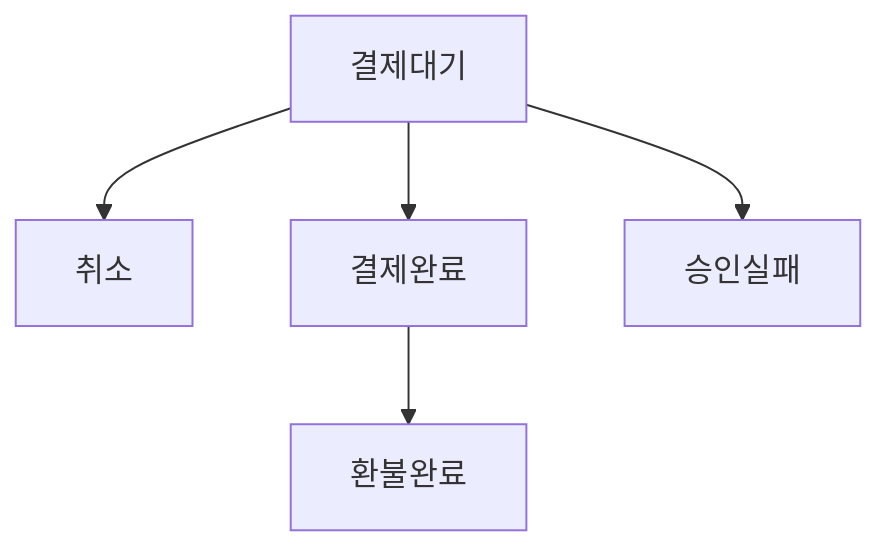
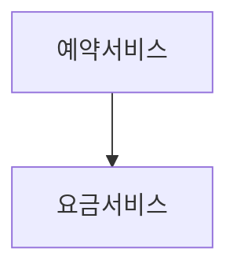
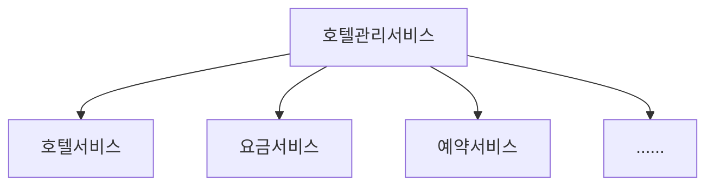
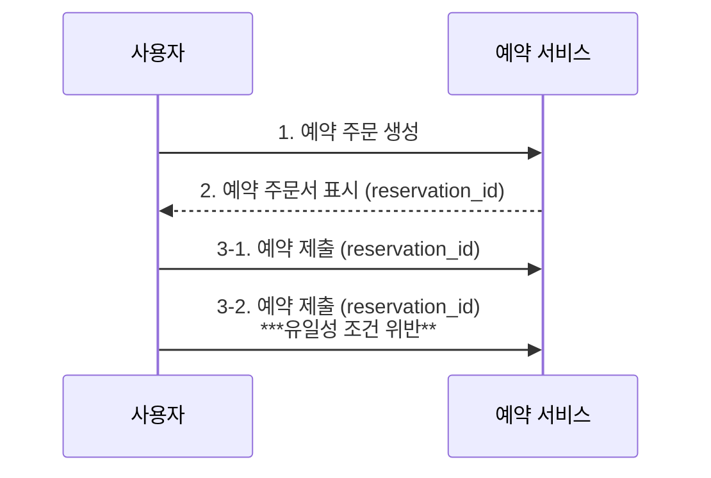

# 7장. 호텔 예약 시스템


<aside>
💡 유사한 시스템 설계 유형

- 에어비앤비 시스템 설계
- 항공권 예약 시스템 설계
- 영화 티켓 예매 시스템 설계
</aside>

## 1단계 문제 이해 및 설계 범위 확정

- `시스템 규모`
    
    5000개 호텔에 100만 개 객실을 갖춘 호텔 체인을 위한 웹사이트 구축
    
- `예약 관련`
    
    
    | 예약금 | 예약 시에 전부 지불, 시간 제한 존재 |
    | --- | --- |
    | 수단 | 호텔 웹사이트나 앱에서만 가능 |
    | 기능 | 취소 기능 지원 |
- `기타 고려사항`
    - 10% 초과 예약 가능 : 실제 객실 수보다 더 많은 객실을 판매할 수 있어야 함 (일부 고객이 취소할 것을 염두에 둠)
    - 객실 가격은 유동적 (객실이 여유로운지에 따라 매일 달라질 수 있음)
- `주요 기능`
    - 호텔 정보 페이지 표시
    - 객실 정보 페이지 표시
    - 객실 예약 지원
    - 호텔이나 객실 정보를 추가/삭제/갱신하는 관리자 페이지 지원
    - 초과 예약 지원

### 비기능 요구사항

- 높은 수준의 동시성 지원 : 성수기, 대규모 이벤트 기간에는 일부 인기 호텔의 특정 객실을 예약하려는 고객이 많이 몰릴 수 있음
- 적절한 지연 시간 : 사용자가 예약할 때 응답 시간이 빠르면 이상적이지만, 몇 초 정도 요청을 처리하는 데 걸리는 것은 감안

### 개략적 규모 추정

- 총 5000개 호텔. 100만 개의 객실이 있다고 가정
- 평균적으로 객실의 70%만 사용 중, 평균 투숙 기간은 3일로 가정
- 일일 예상 예약 건수 : (1백만X0.7) / 3 = 233,333 (약 240,000 건)
- 초당 예약 건수 : 240,000 / 하루에 10^5초 =~ 3  → 초당 예약 TPS는 그리 높지 않음

<aside>
👤 유저 시나리오

1. 호텔/객실 상세 페이지 : 사용자가 호텔/객실 정보를 확인한다 (조회 발생) `QPS=300`
2. 예약 상세 정보 페이지 : 사용자가 날짜, 투숙 인원, 결제 방법 등의 상세 정보를 예약 전에 확인한다 (조회 발생) `QPS=30`
3. 객실 예약 페이지 : 사용자가 ‘예약’ 버튼을 눌러 객실을 예약한다 (트랜잭션 발생) `QPS=3`

*최종 예약 TPS가 3인 것을 바탕으로, 역산한 결과 (약 10%의 사용자가 다음 단계로 진행하고, 90%는 최종 단계에 도달하기 전에 이탈한다고 가정)

</aside>

## 2단계 개략적 설계안 제시 및 동의 구하기

### API 설계

- 호텔 관련 API
    
    
    | API | Description |
    | --- | --- |
    | GET /v1/hotels/id | 호텔의 상세 정보 반환 |
    | POST /v1/hotels | 신규 호텔 추가 (호텔 직원 only) |
    | PUT /v1/hotels/id | 호텔 정보 갱신 (호텔 직원 only) |
    | DELETE /v1/hotels/id | 호텔 정보 삭제 (호텔 직원 only) |
- 객실 관련 API
    
    
    | API | Description |
    | --- | --- |
    | GET /v1/hotels/:id/rooms/id | 객실 상세 정보 반환 |
    | POST /v1/hotels/:id/rooms | 신규 객실 추가 (호텔 직원 only) |
    | PUT /v1/hotels/:id/rooms/id | 객실 정보 갱신 (호텔 직원 only) |
    | DELETE /v1/hotels/:id/rooms/id | 객실 정보 삭제 (호텔 직원 only) |
- 예약 관련 API
    
    
    | API | Description |
    | --- | --- |
    | GET /v1/reservations | 로그인 사용자의 예약 이력 반환 |
    | GET /v1/reservations/id | 특정 예약의 상세 정보 반환 |
    | POST /v1/reservations | 신규 예약 |
    | DELETE /v1/reservations/id | 예약 취소 |
    - Request Body
        
        ```json
        {
        		"startDate": "2021-08-17",
        		"endDate": "2021-08-18",
        		"hotelID": "245",
        		"roomID": "U1234567", 
        		"reservationID": "12333"   // 이중 예약 방지용 **멱등 키(idempotent key)**
        }
        ```
        

### 데이터 모델

<aside>
 지원해야 할 Query

1. 호텔 상세 정보 확인 (read)
2. 지정된 날짜 범위에 사용 가능한 객실 유형 확인 (read)
3. 예약 정보 기록 (write)
4. 예약 내역 또는 과거 예약 이력 정보 조회 (read)
</aside>


데이터베이스 스키마

> **관계형 데이터베이스**를 선택한다
> 
- **read** >> write 빈도의 읽기가 압도적인 작업 흐름을 잘 지원함
    - 방문자 수가 실제로 예약하는 사용자 수보다 훨씬 많을 것
- ACID(원자성, 일관성, 격리성, 영속성)을 보장
    - 예약 시스템에서 특히 중요한 속성
    - 데이터베이스에서 충분히 보장된다면, 애플리케이션 코드는 훨씬 단순해짐
- 쉽게 데이터 모델링 가능 (구조, 엔티티 간의 관계를 안정적으로 지원)

**[상태 천이도 다이어그램]**



에어비앤비의 경우, room_id가 있으므로 문제가 되지 않지만

호텔의 경우, 사용자가 특정 객실이 아닌 **특정 호텔의 특정 객실 유형**[스탠다드 룸/킹 사이즈 룸/퀸 사이즈 룸]을 예약하므로 room_id가 존재하지 않으므로, 위 DB 스키마는 문제가 된다.

### 개략적 설계안


> MSA 아키텍처 사용
> 
- `사용자` : 객실을 예약하는 당사자
- `관리자(호텔 직원)` : 고객 환불, 예약 취소, 객실 정보 갱신 등의 관리 작업 수행
- `CDN` : 이미지, 동영상, HTML 등 모든 정적 콘텐츠를 캐시하여 웹사이트 로드 성능을 개선하는 데 이용
- `공개 API 게이트웨이` : 처리율 제한, 인증 등의 기능을 지원하는 완전 관리형 서비스
    - 엔드포인트를 기반으로 특정 서비스에 요청 전달
- `내부 API` : 승인된 호텔 직원만 사용 가능한 API (by 내부 소프트웨어, 웹사이트)
    - VPN 등의 기술로 보안 구성
- `호텔 서비스` : 호텔과 객실에 대한 상세 정보 제공 (대부분 정적 데이터 ⇒ 캐시해둠)
- `요금 서비스` : 미래의 어떤 날에 어떤 요금을 받아야 하는지 데이터를 제공하는 서비스
- `예약 서비스` : 예약 요청을 받고 객실을 예약하는 과정 처리, 잔여 객실 정보 갱신 처리
- `결제 서비스` : 고객의 결제를 맡아 처리하고, 절차의 성공/실패 여부에 따라 상태 업데이트
- `호텔 관리 서비스` : 승인된 호텔 직원만 사용 가능한 서비스
    - 임박한 예약 기록 확인, 고객 객실 예약, 예약 취소 등의 admin 기능 제공

**[단순화한 서비스 간 연결 관계]**





*실제 상업적으로 이용되는 시스템의 서비스 간 통신에 gRPC와 같은 고성능 원격 프로시저 호출 프레임워크를 사용하는 경우가 많다.

## 3단계 상세 설계

### 개선된 데이터 모델

호텔의 요구사항도 만족하기 위해서는 (room_id를 식별자로 사용 불가) 다음과 같은 수정이 필요하다. 

[DB Schema]


- room : 객실에 관계된 정보
- room_type_rate : 특정 객실 유형의 특정 일자 요금 정보
- reservation : 투숙객 예약 정보
- **room_type_inventory** : 호텔의 모든 객실 유형
    - total_inventory : (총 객실 수 - 일시적으로 제외한 객실 수)
    - total_reserved : 지정된 hotel_id, room_type_id, date에 예약된 모든 객실의 수
    
    🔑 pk - **`(hotel_id, room_type_id, date)`**
    
    → 주로 고객이 특정 유형의 객실을 예약할 수 있는지 여부를 확인할 때 사용
    

[API 변경사항] 

 `POST` /v1/reservations

- Request Param
    
    ```json
    {
    		"startDate": "2021-08-17",
    		"endDate": "2021-08-18",
    		"hotelID": "245",
    		**"roomTypeID": "U1234567",** 
    		"reservationID": "12333"  
    }
    ```
    
    - roomID → roomTypeID

[저장 용량 추정]

*2년 이내 모든 미래 날짜에 대한 가용 객실 데이터 결과를 토대로 데이터를 채워둔 상태여야 함

**`room_type_inventory`** 테이블에 저장해야 할 레코드 수

5,000 (호텔 수) X 20 (객실 유형) X 2년 X 365일 = 약 7,300만 개 

그리 많은 데이터는 아니므로 1개의 데이터베이스만 사용해도 충분하지만, 데이터베이스 서버를 하나만 두는 것 자체만으로 SPOF 문제는 따를 수 있어 대비가 필요하다. 

→ 고가용성을 위해 여러 지역/가용성 구역에 DB를 복제하여 해결 가능

<aside>
🤔 *만약 예약 데이터가 단일 DB에 담기에 너무 크다면?*

1. **현재 및 향후 예약 데이터만 저장** → 예약 이력은 자주 접근하지 않으므로 아카이빙 하거나 cold storage로 이동
2. **데이터베이스 샤딩 -** hotel_id를 샤딩 키로 사용하여, `hash(hotel_id)%number_of_servers`로 샤딩해두기
    
    *자주 사용되는 질의 - 1) 예약 2) 투숙객 이름으로 예약 확인
    
</aside>

### 동시성 문제

> *이중 예약을 어떻게 방지할 수 있을까?*
> 

**#1. 같은 사용자가 예약 버튼을 여러 번 누를 수 있다**


1. 클라이언트 측 구현
    
    클라이언트에서 요청 전송 이후, ‘예약’ 버튼을 비활성화 하는 등의 처리
    
    → but, 그리 안정적이지 못함
    
2. 멱등 API : 몇 번을 호출해도 같은 결과를 내는 API
    
    예약 API의 요청에 멱등 키를 추가하기 (e.g. `reservation_id`)
    




- `reservation_id` 는 전역적 유일성을 보증하는 ID 생성기가 만들어 낸 식별자다.  (3-1에서 새로 생성됨)
- 만약 3-2에서 동일한 요청이 오면, 해당 reservation_id에 대한 기본 키의 유일성 조건이 위반되어 **새로운 레코드를 생성하지 않는다.  (→ 이중 예약 문제는 피할 수 있음)**

**#2. 여러 사용자가 같은 객실을 동시에 예약하고자 할 수 있다**

*DB 트랜잭션 격리 수준이 가장 높은 수준(직렬화 가능 수준)이 아니라고 가정

[초기 설정] total_inventory = 100, total_reserved = 99

👤 사용자1 (= 트랜잭션1) 

1. 잔여객실 확인 : 1개 남음
2. 객실 예약 : ***total_reserved += 1***
    
    (total_reserved + rooms_to_book) ≤ total_inventory인지 검사 ⇒ **True**
    

---

total_inventory = 100, total_reserved = 100

👤 사용자2 (= 트랜잭션2) 

a. 잔여객실 확인 : 1개 남음

c. 객실 예약 : ***total_reserved += 1***

(total_reserved + rooms_to_book) ≤ total_inventory인지 검사 ⇒ **True**

---

total_inventory = 100, total_reserved = 100

위 상황에서 트랜잭션 1이 커밋하기 직전까지는 트랜잭션 2에 보이지 않는다. 결과적으로 이중 예약이 발생한 것이다. 

→ 이는 락(lock) 기법으로 해결할 수 있다. 

[락 메커니즘]

**A. 비관적 락** (비관적 동시성 제어 방안)

> 사용자가 레코드를 갱신하려고 하는 순간 즉시 락을 걸어 동시 업데이트를 방지하는 기술
> 


- 해당 레코드를 갱신하려는 다른 사용자는 먼저 락을 건 사용자가 변경을 마치고 락을 해제할 때까지 기다려야 함
- e.g. MySQL의 `SELECT ... FOR UPDATE` 문

👍🏻 장점

- 애플리케이션이 변경 중이거나 변경이 끝난 데이터를 갱신하는 상황을 막을 수 있음
- 구현이 쉽고, 모든 갱신 연산을 직렬화하여 충돌을 막음 (race condition이 심한 경우에 적합)

👎🏻 단점

- 여러 레코드에 락을 걸면 deadlock이 발생할 수 있음 (코드도 매우 까다로워짐)
- 확장성이 낮음 → 너무 오랫동안 트랜잭션이 락을 잡고 있으면 다른 트랜잭션이 자원에 접근할 수 없으므로 DB 성능이 꽤나 저하될 것

**B. 낙관적 락** (낙관적 동시성 제어 방안)

> 여러 사용자가 동시에 같은 자원을 갱신하려 시도하는 것을 허용
> 


1. DB 테이블에 `version` 컬럼 추가
2. 사용자가 레코드 수정 전에 애플리케이션은 해당 레코드의 `version`을 읽음
3. 갱신 시, **`version+1`**로 기록
4. 유효성 검사 수행 - 실패 시 트랜잭션 abort → (b)부터 다시 수행

→ 구현 방식

1. 버전 번호 ✅ **서버 시계가 부정확해질 수 있으므로 버전 번호가 더 좋은 선택지**
2. 타임스탬프

👍🏻 장점

- 애플리케이션이 유효하지 않은 데이터를 편집하는 일을 막음
- 데이터베이스 자원에 락을 걸 필요 X
    - `버전 번호` - 애플리케이션에 **데이터 일관성의 책임**을 넘기는 것
    - 비관적 락보다 빠름
- 데이터에 대한 경쟁이 치열하지 않은 상황에 적합 → 락을 관리하는 비용 없이 트랜잭션 실행 가능

👎🏻 단점

- 동시성 수준이 아주 높은, 경쟁이 치열한 상황에서는 성능이 좋지 않음

**→ 예약 QPS는 일반적으로 높지 않으므로, 호텔 예약 시스템에서 낙관적 락은 적합한 선택지이다.** 

**C. 데이터베이스 제약조건**

> `room_type_inventory` 테이블에 제약조건을 추가해보자.
> 
> 
> ```sql
> CONSTRAINT `check_room_count` CHECK((`total_inventory - total_reserved` >= 0))
> ```
> 


👍🏻 장점

- 구현이 쉬움
- 데이터에 대한 경쟁이 심하지 않을 때 잘 동작

👎🏻 단점

- 데이터에 대한 경쟁이 심하면 실패하는 연산 수가 매우 늘어나게 됨 (like 낙관적 락)
- 애플리케이션 코드와 달라 버전을 통제하기 어려움
- 제약조건을 허용하지 않는 DB도 있어 DBMS의 유연한 교체가 불가능함

### 시스템 규모 확장

> *호텔 예약 시스템이 타 유명한 여행 예약 웹 사이트와 연동되어야 한다면?*
> 

QPS가 천 배 이상 늘어날 수 있는 상황이므로, 시스템 부하를 막기 위한 고민을 해봐야 한다. 

**`데이터베이스 샤딩` -** ”데이터베이스의 규모를 늘리자”

- 대부분의 쿼리에서 hotel_id를 필요로 하므로, 해당 키를 샤딩 조건으로 가져가자

**`캐시`** 


- 이력 데이터는 다른 DB를 통해 질의하도록 하자 → Redis가 적합 (TTL, LRU 캐시 교체 정책을 사용해 메모리를 최적으로 사용할 수 있기 때문)
- 예약 트래픽 증가에 따라 **데이터 로딩 속도, DB 확장성**이 문제가 된다면, DB 앞에 캐시 계층을 두어 해당 계층에서 1) 잔여 객실 확인 2) 객실 예약 로직 등이 이루어지도록 처리할 수 있다
- **예약 서비스** : 잔여 객실 관리 API 제공
    1. 지정된 호텔과 객실 유형, 주어진 날짜 범위에 이용 가능한 객실 수 질의
    2. 객실 예약 및 total_reserved += 1
    3. 예약 취소 시, 잔여 객실 수 갱신
- **잔여 객실 캐시** : 모든 잔여 객실 관리에 필요한 질의를 Redis로 구현된 캐시로 이동시킴
    
    → 사전에 잔여 객실 정보를 캐시에 미리 저장해둬야 함
    
    ```sql
    key: hotelID_roomTypeID_{날짜}
    value: 주어진 호텔 ID, 객실 유형 ID, 날짜에 맞는 잔여 객실 수
    ```
    
- **잔여 객실 데이터베이스** : 잔여 객실 수에 대한 가장 믿을 만한 정보 보관
    
    

<aside>
🚀 캐시 도입 이후의 과제 : **DB-캐시 간의 데이터 일관성 유지**

주로 DB가 먼저 갱신되면 그 다음 캐시에 비동기적으로 변경 내역이 반영된다. 

→ 이 갱신 작업이 이루어지는 경로는 

1. 애플리케이션 측에서 DB에 데이터를 저장한 다음 캐시 데이터를 수정하기
2. 변경 데이터 감지(CDC) 메커니즘 사용 (e.g. 드베지움) → DB source connector가 변화를 감지하여 캐시에 반영하도록 하기

위와 같은 방식으로 가능하다. 그 사이에 질의를 하게 되면 캐시에는 최신 데이터가 없을 가능성이 있고, 최종적으로 DB에서 잔여 객실을 확인하도록 하면 문제가 해결된다. 

</aside>

👍🏻 장점

- 읽기 질의를 캐시가 처리하므로 데이터베이스의 부하가 크게 줄어듦
- 읽기 질의를 메모리에서 실행하므로 높은 성능 보장

👎🏻 단점

- 데이터베이스와 캐시 사이의 데이터 일관성을 유지하지 못할 때의 사용자 경험은 치명적일 수 있음

### 서비스 간 데이터 일관성


모노리스 VS 마이크로서비스

모노리스 아키텍처는 여러 연산을 하나의 트랜잭션으로 묶어 ACID 속성이 만족되도록 보장할 수 있다. 하지만 마이크로서비스 아키텍처는 각 서비스에서 독자적으로 DB를 갖는 구조이므로, 하나의 원자적 연산이 여러 DB에 의해 실행되는 일을 피할 수 없다. (즉, 여러 개의 트랜잭션으로 일관성을 보장해야 하는 상황)

→ 이는 데이터 불일치를 일으킬 수 있어 위험

**`모노리스 아키텍처`**


**`마이크로서비스 아키텍처`**


**[데이터 일관성 문제를 해결하기 위한 방안]**

- 2단계 커밋(2-phase commit, 2PC) : 여러 노드에 걸친 원자적 트랜잭션 실행을 보증하는 데이터베이스 프로토콜
    - 모든 노드가 성공 또는 실패 둘 중 하나로 트랜잭션이 마무리되도록 보증
    - blocking protocol - 비중단 실행이 가능하지 않으므로, 한 노드에 장애가 발생하면 복구될 때까지 진행 증단 (성능은 그리 뛰어나지 X)
- 사가(Saga) : 각 노드에 국지적으로 발생하는 트랜잭션을 하나로 엮은 것
    - 각각의 트랜잭션이 완료되면 다음 트랜잭션을 시작으로 하는 트리거로 쓰일 메시지를 만들어 보낸다
    - 각 단계가 하나의 트랜잭션이므로, **결과적 일관성**에 의존하는 방식
        - 어느 하나라도 실패하면 그 이전 트랜잭션 결과까지 전부 순차적으로 되돌림
        

## 4단계 마무리

### 요약


